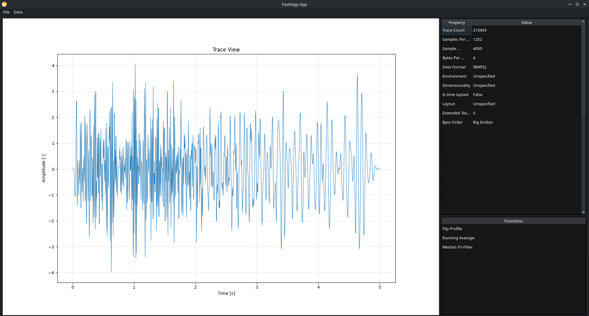
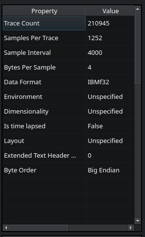
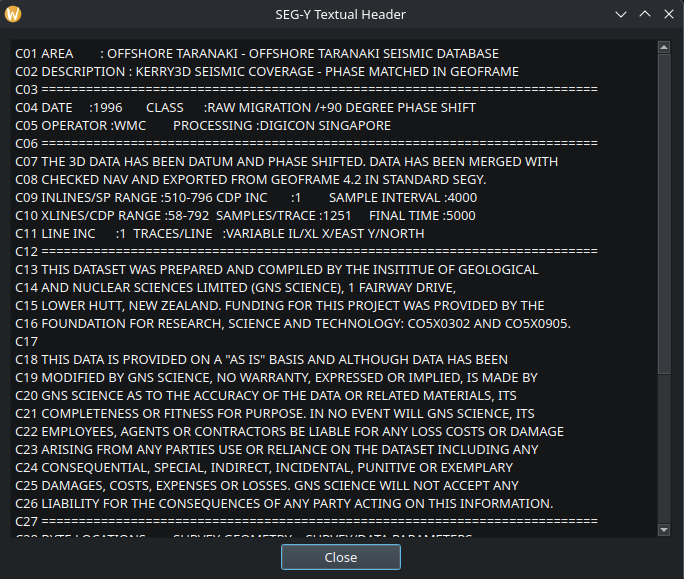
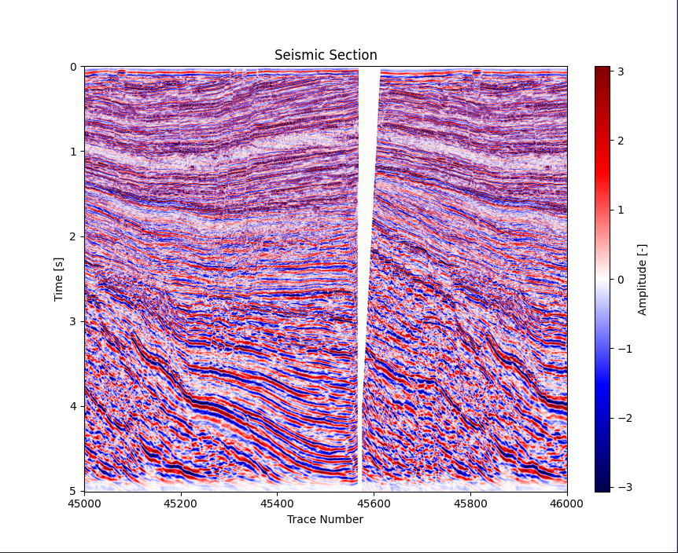
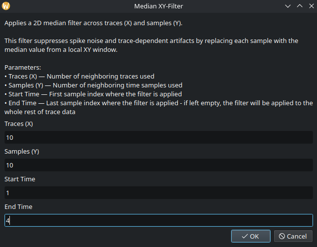
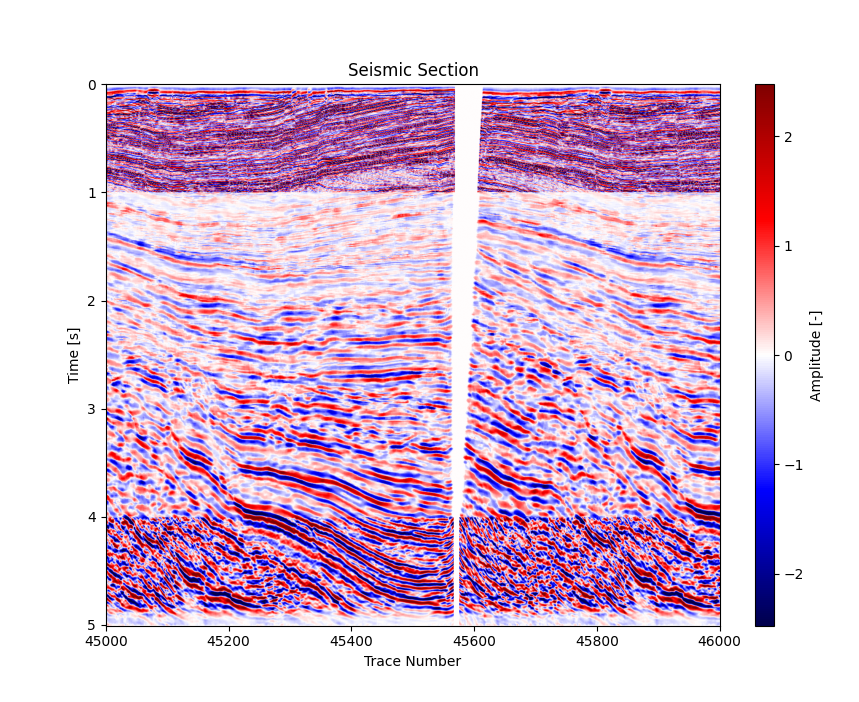

**The main branch contains the most up-to-date stable version of the program. It supports SEG-Y files
following the Revision-0 and Revision-1 standards. Other branches may contain upgrades regarding performance, 
file standards or customization.**

## Fastsegy

Performant SEG-Y reader with Python bindings.  
Enables access to metadata, trace headers, trace data, and trace ranges from SEG-Y files used in seismic and geophysical measurements. Combines Rust for fast parsing with Python for easy integration and GUI development.

## Features
### Rust Library
The library to parse the seismic data was created in Rust. While Rust was chosen simply because I enjoy writing 
Rust code, the project does benefit from its speed. Especially since the parsing process utilizes loops, data decoding 
and memory mapping which carries some overhead in more abstracted languages. The most important features of this library:

- Reads SEG-Y textual headers encoded as ASCII or EBCDIC  
- Parses binary header to extract key metadata  
- Handles decoding of data encoded in different formats (IEE754, IBM-float32, signed int etc.)
- Exposes Python bindings via PyO3 for easy integration with Python frontend
- Utilizes memory mapping for performance gains while reading trace data 
- Supports SEG-Y Rev 0 and Rev 1 files
- Allows user to save processed data as SEG-Y files

### GUI
This codebase contains a GUI built in Python with PyQt6 library. It allows user to easily visualize traces and sections.
It also allows for easy access to processing functions, currently fully implemented in Python

### Processing
Raw seismic data may not always be useful, so I decided to implement some functions that most geophysical software offers.
Current version allows users to use **Running Average Filter**, **XY-Median Filter** and **X/Y Profile Flip**. 
Those functionalities are currently implemented in Python. That may change based on performance of more 
computation heavy algorithms implemented later. 

Changes are stored in memory and do not affect the actual source file. Applied changes can be saved into new SEG-Y file.

## Planned Features
The main goal for this project was to learn Rust. I did however grow fond of this project and decided to push it further and achieve relatively functional software. My main goal is to create a stable version allowing user to process and analyze seismic SEGY data.
Current improvement plans include:

- Improvements to file initialization. NOTE:  Windows seems to have issues with memory-mapped file access that results in significantly slower startup times. Resolving this is planned but is currently low priority, as the primary development environment is Linux."
- Handling of newer Revision standards (i.e. 2 and possibly 2.1). NOTE: Versions 2.0 and 2.1 add some cases that might not be easy to parse. What's more, there seem to be **very** limited amount of data actually using that Revision standards. For this reason I might give up on supporting them for now  
- Rendering optimizations (current Matplotlib bottleneck)
- More customizable GUI
- Improvements to UX
- More processing functionalities
- Addition of a manual with accurate descriptions of functions, their practical use and other functionalities of GUI
- Add an executable to skip the building steps

## SEGY data source

Access to free seismic data is possible via [seg wikipedia](https://wiki.seg.org/wiki/Open_data)

## Installation
This project uses [Maturin](https://github.com/PyO3/maturin) to build and install the Rust-based Python extension.
For the time being, you have to install all Python libraries and Rust tools manually. That will be improved in future with pip-installable wheel/installer/.exe 

Make sure you have the following installed:

- Python 3.10 or newer
- [Rust toolchain](https://www.rust-lang.org/tools/install)
- pip

Create a virtual environment and install the following Python libraries:
- Maturin
- Matplotlib
- Numpy
- Scipy
- PyQt6

To build the Rust library, you will have to run the following command from the project root directory:

`maturin develop --release` 

This will build the library and allow Python to use the bindings.

Make sure your virtual environment is activated before running `maturin develop`.

**On Linux**, you may need to install build tools, but the project should work same as on Windows:

`sudo apt install Python3-dev build-essential`

To run the GUI you want to run the app.py script located in Python/fastsegy/gui/app.py.
Assuming that you have installed the libraries globally or activated a virtual environment, you could run the following command in console from the project root directory:

`Python Python/fastsegy/gui/app.py`

## Preview (Kerry3D used as input data - accessible through segy wiki)
**Please note, that the rendered UI might differ based on your OS or (in case of Linux) Desktop Environment you are using. 
Those screenshots have been produced on Fedora Linux with KDE Plasma.**

Full window with view of a chosen trace presented on a plot.

Metadata view - the right panel (count of displayed properties is subject to change):

Preview into Textual Header of the file:

Plot of a seismic section (traces 45000 - 46000):

Window with settings of median XY filter:

Plot after applying median filter with settings presented above:

